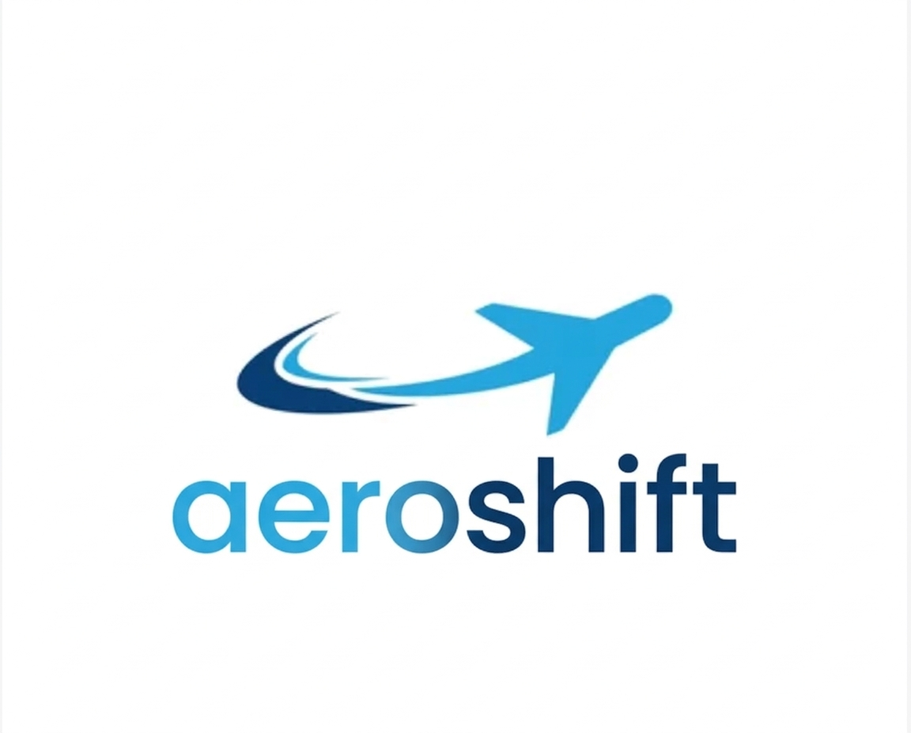

<p align="center">
  
</p>

<h1 align="center">AeroShift</h1>

<p align="center">
  Detecting distribution shifts in aircraft arrival behavior using unsupervised learning.
</p>

AeroShift is a machine learning framework for detecting distribution shifts in aircraft arrival trajectory behavior using unsupervised clustering.

The system extracts geometric and kinematic features from flight trajectories, learns recurring behavioral patterns, and monitors changes in their distribution over time.


## Overview

Airspace operations generate large volumes of trajectory data. Subtle shifts in arrival behavior can indicate changes in:

- Air traffic control procedures  
- Weather conditions  
- Airspace congestion  
- Operational constraints  

AeroShift models arrival trajectories as behavioral feature vectors and applies unsupervised clustering to identify recurring operational patterns. It then evaluates distributional changes across time windows to detect systemic behavioral shifts.

The framework is designed as a modular research pipeline, separating feature engineering, clustering, and shift detection components.


## Methodology

### Trajectory Representation

Each flight is represented as a time-ordered sequence containing:

- Latitude  
- Longitude  
- Altitude  
- Ground speed  
- Timestamp  

The raw trajectory is transformed into a compact feature vector summarizing geometric structure, speed behavior, turning dynamics, and descent characteristics.


### Feature Engineering

Feature extraction modules are located in `src/features/`.

The system extracts the following categories of features:

#### Geometry
- Total path distance  
- Straight-line distance  
- Path efficiency ratio  
- Bearing change statistics  

#### Speed Profile
- Mean ground speed  
- Ground speed standard deviation  
- Speed variability metrics  

#### Turning Behavior
- Instantaneous turn rate  
- Mean absolute turn rate  
- Turn rate variance  
- High-curvature frequency  

#### Descent Profile
- Mean vertical speed  
- Vertical speed standard deviation  
- Descent stability metrics  

Each flight is converted into a fixed-length numerical vector:

[distance,
path_efficiency,
mean_ground_speed,
std_ground_speed,
mean_turn_rate,
std_turn_rate,
mean_vertical_speed,
std_vertical_speed,
...]


This representation enables direct application of unsupervised learning algorithms.


### Behavioral Clustering

Unsupervised clustering is used to identify recurring arrival behavior types.

Candidate algorithms include:

- KMeans  
- Gaussian Mixture Models  
- DBSCAN  

Clusters represent statistically recurring trajectory structures without requiring labeled data.

The resulting cluster assignments define the behavioral distribution of a given time window.


### Distribution Shift Detection

Once a baseline cluster distribution is established, AeroShift monitors new flight windows and compares cluster proportions.

Potential divergence metrics include:

- Kullback–Leibler divergence  
- Jensen–Shannon distance  
- Population Stability Index  

Significant divergence indicates a behavioral distribution shift in arrival operations.


## Repository Structure

```
AeroShift/
│
├── data/
│   ├── raw/
│   └── processed/
│
├── notebooks/
│
├── src/
│   ├── features/
│   │   ├── geometry.py
│   │   ├── speed.py
│   │   ├── turning.py
│   │   ├── descent.py
│   │   └── pipeline.py
│   │
│   ├── clustering/
│   ├── shift_detection/
│   ├── anomaly/
│   └── utils/
│
├── requirements.txt
└── README.md
```

The codebase is organized to isolate feature extraction, modeling, and evaluation logic for reproducibility and extensibility.


The codebase is organized to isolate feature extraction, modeling, and evaluation logic for reproducibility and extensibility.


## Data

The current implementation uses synthetic trajectory data to validate:

- Feature stability  
- Cluster separability  
- Shift detection sensitivity  

Synthetic generation enables controlled variation in arrival behaviors such as:

- Straight-in approaches  
- Downwind entries  
- Holding patterns  

Future work includes integration with real ADS-B trajectory datasets.


## Installation

Clone the repository:

git clone https://github.com/<your-username>/AeroShift.git
cd AeroShift

Create and activate a virtual environment:

Install dependencies:


## Running the Feature Pipeline


This will:

1. Load trajectory data  
2. Compute feature vectors  
3. Output processed feature tables  

Subsequent clustering and shift detection modules can then be executed using the generated feature dataset.


## Reproducibility

To reproduce experiments:

1. Generate or load trajectory data in `data/raw/`  
2. Run the feature pipeline  
3. Execute clustering module  
4. Compute baseline cluster distribution  
5. Evaluate distribution shift across defined time windows  

All modules are deterministic given fixed random seeds.

Future updates will include configuration files for parameter control and experiment tracking.


## Research Motivation

Air traffic systems are complex, adaptive environments. Detecting operational shifts at scale requires automated behavioral modeling rather than manual trajectory inspection.

AeroShift explores a trajectory-centric, unsupervised approach to modeling arrival behavior and detecting distributional change in spatiotemporal systems.

The framework is intended as a research platform for:

- Airspace operations analysis  
- Aviation anomaly detection  
- Distribution shift modeling  
- Applied machine learning in aerospace systems  


## Future Work

- Real-world ADS-B data integration  
- Online streaming shift detection  
- Airport-specific modeling  
- Statistical validation of shift thresholds  
- Visualization dashboard  
- Deployment-ready monitoring service  


## Citation

If you use AeroShift in research, please cite this repository.

Citation format to be added upon publication.